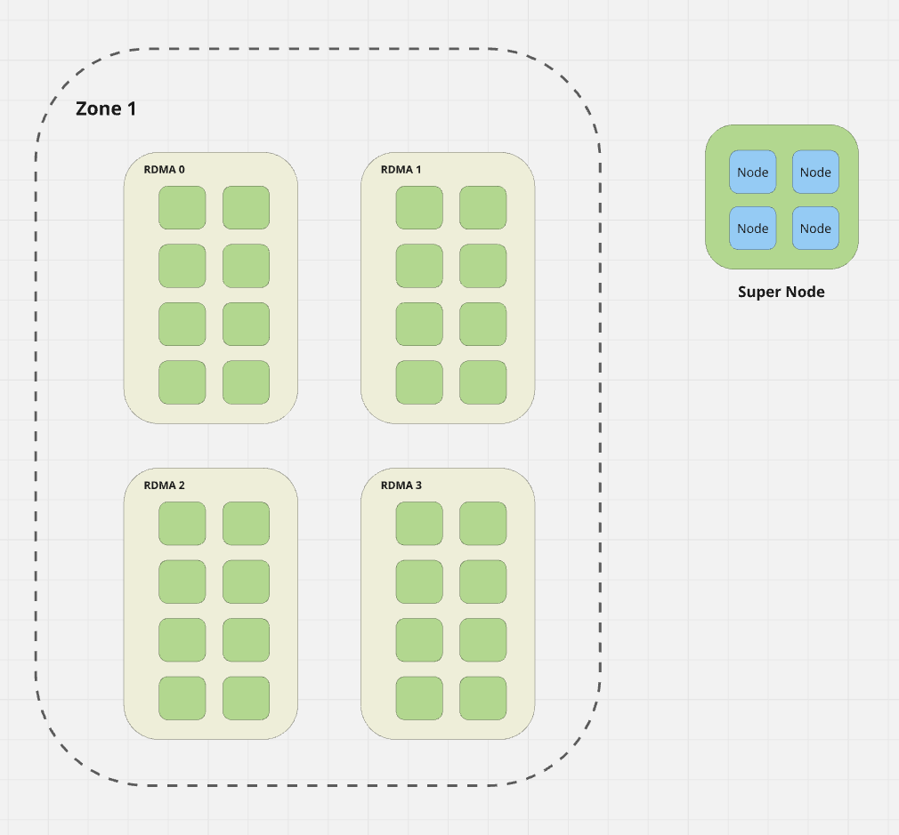

# Test with Kueue TAS

## Preparation

* Install [Kind](https://github.com/kubernetes-sigs/kind).
* Install [Kwok](https://kwok.sigs.k8s.io/docs/user/kwok-in-cluster/) in a cluster.
* Run with `kubectl delete stage pod-complete` to make sure Pods always consuming the GPUs.
* Install [Kueue](https://github.com/kubernetes-sigs/kueue) with version > v0.9 to make sure TAS is enabled.
* Enable TAS in kueue with configurations:
    ```yaml
    spec:
        containers:
        - args:
            - --config=/controller_manager_config.yaml
            - --zap-log-level=2
            - --feature-gates=TopologyAwareScheduling=true
    ```

**Note**: Install job controllers as you need. For instance, we use pytorchJob here, so we need to install the kubeflow training operator and CRDs first:

```yaml
kubectl apply --server-side -k "github.com/kubeflow/training-operator.git/manifests/overlays/standalone?ref=v1.8.1"
```

## Initialization

First of all, the topology generally looks like:


Following the steps to initialize the environment:

* Apply the `topology.yaml` to draw the topologies, we'll have a 3k GPU cluster.
* Create fake nodes with [init.sh](./init.sh), only one RDMA domain is initialized.
* Create batch job or pytorchJob as your need to mock the cases, like [TP16](./tp16.yaml) or [TP32](./tp32.yaml) or simple [job](./job.yaml).

**Note**: Pods should have toleration to be scheduled to fake nodes:
```yaml
tolerations:
- key: "kwok.x-k8s.io/node"
    operator: "Exists"
    effect: "NoSchedule"
```

## GC

Run with [gc.sh](./gc.sh) to delete all the fake nodes.
